## Hi there 👋

<!-- 基本Markdown -->

 
 

# :orange_book: Latest Blog Posts :cactus:
<!-- BLOG-POST-LIST:START -->
- [一文详解Softmax与Sigmoid函数](https://blog.csdn.net/qq_60865111/article/details/146462079)
- [如何快速评估模型改进后的整体性能效果](https://blog.csdn.net/qq_60865111/article/details/146263850)
- [YOLOv12源码及模型权重——免费下载](https://blog.csdn.net/qq_60865111/article/details/145749175)
- [YOLOv12训练自己的数据集——利用Google Colab环境和Roboflow工具](https://blog.csdn.net/qq_60865111/article/details/145747523)
- [《YOLOv12 - 注意力机制驱动的实时目标检测新篇章》——论文详解](https://blog.csdn.net/qq_60865111/article/details/145746015)
<!-- BLOG-POST-LIST:END -->

<!--
**BreCaspian/BreCaspian** is a ✨ _special_ ✨ repository because its `README.md` (this file) appears on your GitHub profile.

profile-3d-contrib/profile-green-animate.svg
样式：绿色动态主题
特点：以绿色为主色调，带有动态动画效果，展示您的GitHub贡献记录（如提交、PR等）。
profile-3d-contrib/profile-green.svg
样式：绿色静态主题
特点：与绿色动态版类似，但没有动画效果，适合静态展示。
profile-3d-contrib/profile-season-animate.svg
样式：季节动态主题
特点：根据当前季节（春、夏、秋、冬）自动调整颜色和背景，并带有动态效果。
profile-3d-contrib/profile-season.svg
样式：季节静态主题
特点：与季节动态版类似，但无动画，颜色随季节变化。
profile-3d-contrib/profile-south-season-animate.svg
样式：南半球季节动态主题
特点：专为南半球用户设计，季节与北半球相反（例如北半球夏季时，南半球为冬季），带有动态效果。
profile-3d-contrib/profile-south-season.svg
样式：南半球季节静态主题
特点：南半球季节主题的静态版本，无动画效果。
profile-3d-contrib/profile-night-view.svg
样式：夜景主题
特点：以深色背景和星空效果展示，模拟夜间景观，静态展示。
profile-3d-contrib/profile-night-green.svg
样式：夜间绿色主题
特点：夜景背景搭配绿色贡献块，静态展示。
profile-3d-contrib/profile-night-rainbow.svg
样式：夜间彩虹主题
特点：夜景背景搭配彩虹色贡献块，静态展示。
profile-3d-contrib/profile-gitblock.svg
样式：Git块主题
特点：以GitHub风格的方块形式展示贡献，静态展示。

Here are some ideas to get you started:

- 🔭 I’m currently working on ...
- 🌱 I’m currently learning ...
- 👯 I’m looking to collaborate on ...
- 🤔 I’m looking for help with ...
- 💬 Ask me about ...
- 📫 How to reach me: ...
- 😄 Pronouns: ...
- ⚡ Fun fact: ...
-->

